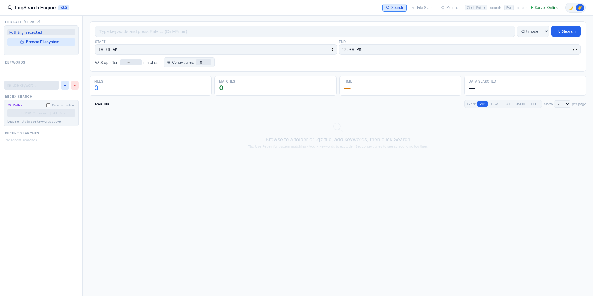
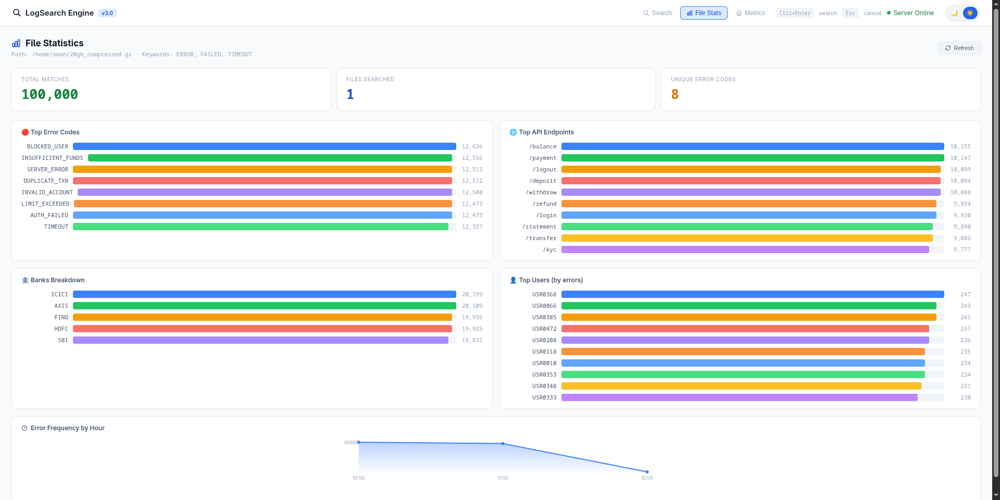
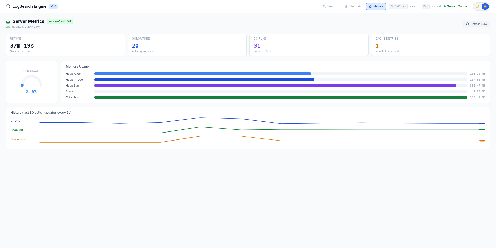

# 🔍 LogSearch Engine v3.0

A high-performance, browser-based log search tool built in Go — designed to search through **large compressed `.gz` log files** instantly, with real-time progress, analytics, and server monitoring.

> Built for searching GBs of banking/application logs in seconds.

---

## 📸 Screenshots

### Search Page


### File Stats Page


### Metrics Page


---

## ✨ Features

### 🔎 Search
- **Keyword Search** — Search single or multiple keywords with `AND` / `OR` mode
- **Regex Search** — Full regular expression support (e.g. `ERROR.*timeout|FAIL\d+`)
- **Exclude Keywords** — Filter out unwanted lines using NOT keywords
- **Case Sensitive Mode** — Toggle exact case matching
- **Time Range Filter** — Search logs between specific start & end times (HH:MM)
- **Context Lines** — See N lines before and after each match for better context
- **Stop After N Matches** — Limit results to avoid overload on huge files
- **Real-time Progress** — Live file count, lines scanned, matches found, elapsed time

### 📊 File Stats Page
After running a search, get instant analytics:
- **Top Error Codes** — Which errors are occurring most (TIMEOUT, SERVER_ERROR, etc.)
- **Top API Endpoints** — Which APIs are failing most (/login, /payment, etc.)
- **Bank-wise Breakdown** — Error distribution across banks (SBI, HDFC, FINO, etc.)
- **Top Users by Errors** — Which user IDs have the most errors
- **Hourly Timeline** — Error frequency chart by hour of day

### 📈 Metrics Page
Live server monitoring — auto-refreshes every 5 seconds:
- **CPU Usage** — Real-time gauge with color indicator (green → amber → red)
- **Memory Usage** — Heap Alloc, Heap In-Use, Heap Sys, Stack, Total Sys
- **Goroutines** — Active Go threads count
- **GC Runs** — Garbage collector runs and pause time
- **Cache Entries** — Number of cached search results on disk
- **Sparkline History** — Last 30 polls graph for CPU%, Heap MB, Goroutines

### 💾 Export Options
- **ZIP** — Full results as ZIP archive
- **CSV** — Spreadsheet-compatible export
- **TXT** — Plain text log lines
- **JSON** — Structured JSON format
- **PDF** — Print-friendly format via browser
- **This Page / All Results** — Export current page or entire result set

### ⚡ Performance
- Aho-Corasick algorithm for ultra-fast multi-keyword matching
- Parallel file processing with goroutines
- Result caching — repeat searches return instantly
- Streaming search results via Server-Sent Events (SSE)
- 5-second no-match timeout to prevent wasted searches
- Handles **20GB+ compressed log files**

---


## 🐳 Docker / Podman

### Quick Start (No Go required)

**Using Podman:**
```bash
podman run -d -p 8080:8080 docker.io/amanvedshukla/logsearch:v3.0
```

**Using Docker:**
```bash
docker run -d -p 8080:8080 amanvedshukla/logsearch:v3.0
```

Open your browser at **http://localhost:8080**

> No Go installation needed — just Docker or Podman!

### Useful Commands

```bash
podman stop logsearch      # Stop
podman start logsearch     # Start
podman restart logsearch   # Restart
podman logs logsearch      # View logs
podman rm logsearch        # Remove container
```

---
## 🚀 Getting Started

### Prerequisites
- [Go 1.21+](https://golang.org/dl/) installed
- Linux / macOS / Windows

### Installation

```bash
# Clone the repository
git clone https://github.com/amanvedshukla/logsearch.git
cd logsearch

# Install dependencies
go mod tidy

# Build
go build ./cmd/uiserver/

# Run
./uiserver
```

Open your browser at **http://localhost:8080**

---

## 📖 How to Use

### Step 1 — Select Log Path
Click **"Browse Filesystem..."** in the sidebar and navigate to:
- A **folder** containing multiple `.gz` files, OR
- A **single `.gz` file**

### Step 2 — Add Keywords
- Type a keyword and press `+` to add it
- Use `−` to add exclude keywords (NOT filter)
- Or use the **Regex** field for pattern matching

### Step 3 — Search
- Click **Search** or press `Ctrl+Enter`
- Watch real-time progress — files, lines, matches, time
- Results appear with syntax highlighting

### Step 4 — Analyse
- Switch to **File Stats** tab to see error breakdown charts
- Switch to **Metrics** tab to monitor server health

### Step 5 — Export
- Choose format: ZIP / CSV / TXT / JSON / PDF
- Click **This Page** or **All Results** to download

---

## ⌨️ Keyboard Shortcuts

| Shortcut | Action |
|----------|--------|
| `Ctrl+Enter` | Start search |
| `Esc` | Cancel search / Close modals |

---

## 📁 Project Structure

```
logsearch/
├── cmd/
│   └── uiserver/
│       └── main.go          # Main server — all HTTP handlers
├── internal/
│   ├── cache/
│   │   └── cache.go         # BadgerDB cache + result file management
│   ├── export/
│   │   └── export.go        # ZIP export logic
│   └── types/
│       └── types.go         # Shared data types (Query, Match, etc.)
├── ui/
│   └── templates/
│       └── index.html       # Full frontend (HTML + CSS + JS)
├── go.mod
└── go.sum
```

---

## 🔧 Configuration

Key constants in `main.go`:

| Constant | Default | Description |
|----------|---------|-------------|
| `NoMatchTimeoutSecs` | `5` | Stop search if no match found in N seconds |
| `MaxDiskMB` | `500` | Max disk usage for exports folder |
| `MaxMemEntries` | `20` | Max in-memory cache entries |

---

## 📡 API Endpoints

| Method | Endpoint | Description |
|--------|----------|-------------|
| `GET` | `/` | Main UI |
| `GET` | `/search/stream` | SSE stream for live search progress |
| `POST` | `/search/page` | Paginated results |
| `POST` | `/stats/file` | File error statistics |
| `GET` | `/metrics` | Server metrics (CPU, RAM, etc.) |
| `GET` | `/browse` | Filesystem browser |
| `POST` | `/download/zip` | Download results as ZIP |
| `POST` | `/download/csv` | Download as CSV |
| `POST` | `/download/txt` | Download as TXT |
| `POST` | `/download/json` | Download as JSON |

---

## 🛠️ Tech Stack

| Layer | Technology |
|-------|-----------|
| Backend | Go (net/http) |
| Search Algorithm | Aho-Corasick (multi-keyword) |
| Cache | BadgerDB |
| Frontend | Vanilla HTML + CSS + JS |
| Streaming | Server-Sent Events (SSE) |
| Compression | gzip (standard library) |

---

## 📋 Log Format Support

The tool is optimised for pipe-separated log lines:

```
2026-04-01 10:00:01 | ERROR | USER:USR0287 | API:/login | TXN:TXN7617548 | AMOUNT:142038.01 | BANK:FINO | ERROR_CODE:TIMEOUT | TRACE_ID:AdBaD06d7d6CCA0
```

The **File Stats** page automatically parses:
- `ERROR_CODE:` → Error code breakdown
- `API:` → Endpoint breakdown  
- `BANK:` → Bank breakdown
- `USER:` → User breakdown
- Timestamp → Hourly timeline

---

## 📝 Changelog

### v3.0
- ✅ Added **File Stats page** — error/API/bank/user charts + hourly timeline
- ✅ Added **Metrics page** — live CPU%, RAM, goroutines, sparkline history
- ✅ Auto-refresh metrics every 5 seconds

### v2.0
- ✅ Exclude keywords (NOT filter)
- ✅ Regex search with case-sensitive mode
- ✅ Context lines (N lines before/after match)
- ✅ CSV & JSON export
- ✅ 5-second no-match timeout
- ✅ Search cancellation
- ✅ Result caching with BadgerDB

### v1.0
- ✅ Basic keyword search in `.gz` files
- ✅ Time range filter
- ✅ ZIP export
- ✅ Real-time SSE progress
- ✅ Recent searches history

---

## 👤 Author

**Aman Ved Shukla**  
GitHub: [@amanvedshukla](https://github.com/amanvedshukla)

---

## ⭐ If this tool helped you, give it a star on GitHub!
